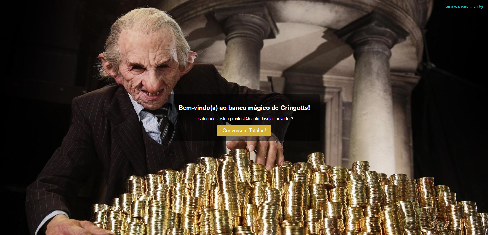

# Conversor de Moedas Mágico de Gringotts

Este projeto foi desenvolvido como parte do Imersão Dev 9ª Edição da Alura e permite converter moedas do mundo real para moedas do universo de Harry Potter.

## ✨ Funcionalidades

- Conversão de moedas do mundo real (BRL, USD, EUR) para Galeões, Sicles e Nuques.
- Interface inspirada no Banco de Gringotts, com um design temático.
- Uso de JavaScript para cálculo de conversões.

## 👨‍💻 Tecnologias Utilizadas

- HTML5
- CSS3
- JavaScript

## 🛠 Visualize o projeto:

[Clique aqui para acessar o conversor](https://codepen.io/Flaviasants/pen/MYWzzzr).

Feito com ❤️ por [Flávia Santos](https://github.com/Flaviasants).